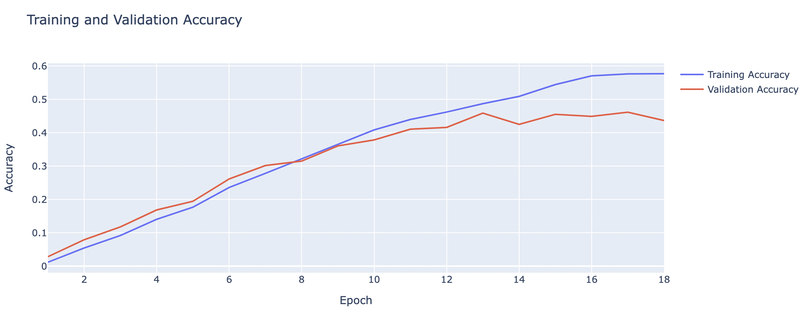
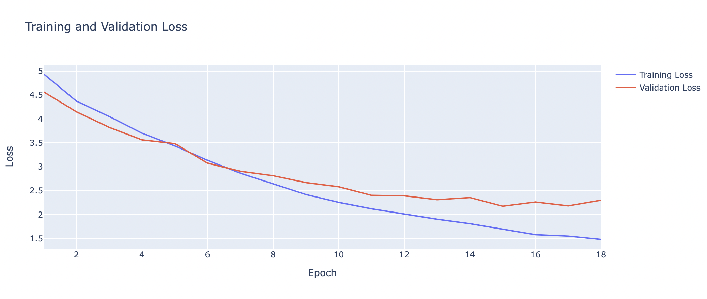

# Dynamic-HTML

## Background
This project aims to classify the yoga pose using simple Convulation Neural Network and VGG16 and serve an interactive HTML page for the project. 

## Data Source
Data used in this project is dataset on yoga pose classification from Kaggle https://www.kaggle.com/datasets/shrutisaxena/yoga-pose-image-classification-dataset

## Result

## Link to Github page
https://sirjanashrestha.github.io/Dynamic-HTML/

